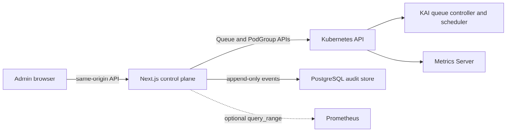

# KAI QueueOps

[](./LICENSE)

An open-source queue lifecycle and resource operations console for [KAI Scheduler](https://github.com/kai-scheduler/KAI-Scheduler). KAI QueueOps manages the complete `scheduling.run.ai/v2` Queue lifecycle, visualizes live queue allocation and demand, surfaces oversubscription, and writes an immutable PostgreSQL audit trail.

> KAI QueueOps is an independent community project. It is not an official component of, affiliated with, or endorsed by the KAI Scheduler maintainers or the Linux Foundation.

## How it fits



Blue shows queue-policy administration, magenta is the native workload scheduling path, green returns live status and utilization, and amber records administrative changes. KAI QueueOps manages and observes queue policy; KAI Scheduler remains responsible for workload placement.

The application is intentionally KAI-native. CPU, memory, and GPU are configurable queue resources. Disk I/O and network throughput are shown only as optional observability signals because the current KAI Queue CRD does not enforce those resources.

## What is implemented

- Live kubeconfig or in-cluster ServiceAccount connectivity.
- Hierarchical queue inventory with parent/leaf semantics.
- Queue creation and updates for every current v2 option:
  - display name and Kubernetes name;
  - parent queue;
  - over-quota priority;
  - CPU, memory, and GPU quota, limit, and over-quota weight;
  - preemption and reclaim minimum runtime;
  - node-pool/shard and ownership labels.
- User-friendly cores/GiB input with exact conversion to KAI millicores/decimal MB.
- Live requested and allocated resources from Queue status.
- Running/pending workload counts from labeled Kubernetes pods.
- `OverQuota` and `Orphan` condition surfacing.
- Capacity-aware defaults, including a safe zero-GPU configuration.
- Resource-version optimistic concurrency on updates.
- Delete preflight that blocks queues with children or workloads, plus typed confirmation.
- PostgreSQL before/after audit events with database-enforced append-only behavior.
- Same-origin + double-submit CSRF validation for browser mutations.
- Trusted identity-proxy actor attribution (opt-in only).
- Least-privilege Kubernetes RBAC and a hardened production deployment example.

## Architecture



Next.js is a good fit here: the App Router UI and server Route Handlers ship as one deployable, while Kubernetes credentials and database access remain server-only. A Go backend would be a reasonable later split if the API becomes a shared multi-client control plane or needs high-volume watch aggregation; it is additional operational complexity for this lifecycle-focused product today.

The interface is implemented directly with React components, Recharts, and repository-owned CSS. It does not use or copy an admin-dashboard framework or template package.

## Verified local test environment

The project has been verified on a three-node, Docker Desktop-hosted kind cluster with:

- KAI Scheduler `v0.16.8` in namespace `kai-scheduler`;
- all KAI components healthy;
- Metrics Server `v0.9.0` for live CPU and memory samples (the local self-signed kubelet exception is test-only);
- PostgreSQL 17 for the append-only audit store;
- test queues and CPU-only workloads from `deploy/test-environment.yaml`;
- graceful zero-GPU capacity handling.

This is the development validation matrix, not a compatibility limit. GPU-backed cluster testing remains an explicit project goal.

## Run locally

Install Node.js 22 and pnpm, then create a private local configuration:

```powershell
Copy-Item .env.example .env.local
# Edit .env.local and replace change-me-before-use before continuing.

docker compose --env-file .env.local up -d postgres
Get-Content -Raw .\migrations\001_audit_events.sql |
  docker exec -i kai-queueops-postgres psql -v ON_ERROR_STOP=1 -U kai_admin -d kai_admin

pnpm install
pnpm dev
```

The app is then available at [http://localhost:3000](http://localhost:3000). `.env.local` is ignored by Git.

To recreate the queue/workload fixtures after KAI is installed:

```powershell
kubectl apply -f .\deploy\test-environment.yaml
```

Install Metrics Server on the local kind/Docker Desktop test cluster:

```powershell
.\deploy\install-local-metrics-server.ps1
```

Run the bounded Python CPU and memory examples and watch the dashboard update:

```powershell
kubectl apply -k .\samples\python-workloads
kubectl get pods -n kai-queueops-test -l app.kubernetes.io/part-of=kai-queueops-workload-samples -w
```

See `samples/python-workloads/README.md` for queue selection, expected allocation/utilization changes, reruns, and cleanup.

## Configuration

| Variable | Purpose |
| --- | --- |
| `KAI_DATA_MODE` | `mock` for a safe product preview or `kubernetes` for the live CRDs. |
| `APP_CONFIG_FILE` | Runtime JSON file for branding, links, feature visibility, local fallback identity, and refresh frequency. |
| `DATABASE_URL` | PostgreSQL connection string. The production deployment should treat this as required. |
| `KUBECONFIG` | Optional path for out-of-cluster use. Omit to use default kubeconfig or in-cluster auth. |
| `PROMETHEUS_URL` | Reserved for an optional historical telemetry provider; the current local test uses live snapshots. |
| `TRUSTED_AUTH_PROXY` | Enables actor identity from a trusted reverse-proxy header. Never enable on a directly exposed service. |
| `TRUSTED_AUTH_HEADER` | The identity header when trusted proxy mode is enabled. |
| `TRUSTED_DISPLAY_NAME_HEADER` | Optional trusted proxy header containing the user-facing display name. |
| `TRUSTED_ROLE_HEADER` | Optional trusted proxy header containing the user-facing access role. |
| `API_MUTATION_TOKEN` | Optional automation-only mutation token. Browser requests use CSRF protection. |

### Runtime UI configuration

Edit `config/ui.config.json` locally, or mount an alternative file and set `APP_CONFIG_FILE`. The file is validated before any values are returned to the browser. Configurable values include:

- application name, short brand, product label, and accent color;
- help, Queue API, and support links;
- recent-audit, audit-page, cluster-page, and extended-telemetry visibility;
- dashboard refresh interval;
- local-development fallback display name and role.

Production user identity is not a cosmetic JSON value. When `TRUSTED_AUTH_PROXY=true`, the username, display name, and role come from the configured trusted proxy headers. `deploy/ui-configmap.yaml` is the Kubernetes-mountable example. Changes to the mounted ConfigMap are picked up by `/api/config`; restart the web pods if the cluster's ConfigMap projection has not refreshed yet.

## Production notes

1. Build and push the `Dockerfile` image.
2. Create `kai-queueops-secrets` in `kai-scheduler` with a `database-url` key.
3. Apply and customize `deploy/ui-configmap.yaml`, then replace the placeholder image in `deploy/webui.yaml`.
4. Put the Service behind an OIDC-aware ingress or identity proxy and configure the exact trusted identity, display-name, and role headers.
5. Apply `migrations/001_audit_events.sql` using a database owner, then run the app with an insert/select-only database role.
6. Add a NetworkPolicy appropriate for the cluster CNI, limiting egress to the Kubernetes API and PostgreSQL.

The provided ClusterRole can mutate only KAI Queues and read the minimum supporting resources (PodGroups, pods, and nodes). The application container runs non-root, drops all Linux capabilities, uses a read-only root filesystem, exposes dependency readiness at `/api/health`, and keeps process liveness independent at `/api/live`.

## Validation commands

```powershell
pnpm typecheck
pnpm lint
pnpm build
Invoke-RestMethod http://localhost:3000/api/health
```

The live smoke test covers create → update → delete through the application API and verifies the KAI spec conversion and PostgreSQL audit rows. The database trigger was also tested to reject mutation of an audit record.

## KAI references

- [Queue API and resource units](https://github.com/kai-scheduler/KAI-Scheduler/blob/main/docs/queues/README.md)
- [Scheduling and fairness deep dive](https://github.com/kai-scheduler/KAI-Scheduler/blob/main/docs/scheduling-deep-dive/README.md)
- [Queue metrics](https://github.com/kai-scheduler/KAI-Scheduler/blob/main/docs/metrics/METRICS.md)
- [Scheduling shards](https://github.com/kai-scheduler/KAI-Scheduler/blob/main/docs/operator/scheduling-shards.md)

## License

KAI QueueOps is available under the permissive [Apache License 2.0](./LICENSE). It permits commercial and private use, modification, and distribution while retaining copyright and license notices.
